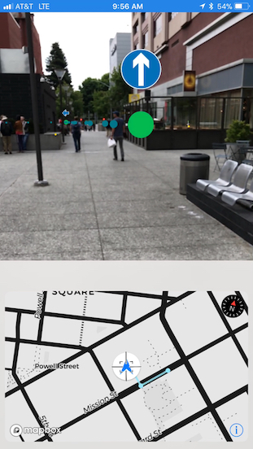

Utilities for combining Mapbox maps and location services with ARKit in your applications.

_**Warning:** The MapboxARKit API is **experimental** and will change. It is published to be able to get feedback from the community. Please use with caution and open issues for any problems you see or missing features that should be added._



### Usage

##### Import MapboxARKit

```Swift
import MapboxARKit
```

##### Declare an an annotation manager instance in your view controller

```Swift
...
@IBOutlet weak var sceneView: ARSCNView!
var annotationManager: AnnotationManager!
...
```

##### Create the annotation manager instance with ARSCNView instance and become the delegate

The easist way to use MapboxARKit is to pass the ARSCNView and interact with the scene via the AnnotationManagerDelegate protocol. However, you can also initialize and `AnnotationManager` instance with only the ARKit session and handle all ARSCNView delegation yourself.

```Swift        
override func viewDidLoad() {
    super.viewDidLoad()
                
    // Create the annotation manager instance and give it an ARSCNView
    annotationManager = AnnotationManager(sceneView: sceneView)
        
    // Become the delegate of the annotation manager
    annotationManager.delegate = self
        
}
```

##### Monitor ARKit camera state readiness

AnnotationManager monitors the ARSession and acts as a proxy for related notifications. This is useful for knowing when it makes sense to interact with the ARSession and ARSCNView and do thing like adding an `Annotation` instance

```Swift
extension ViewController: AnnotationManagerDelegate {

    func session(_ session: ARSession, cameraDidChangeTrackingState camera: ARCamera) {
        switch camera.trackingState {
        case .normal:
            // Tracking is sufficient to begin experience 
            allowARInteractions()
        default:
            break
        }
    }
}
```

##### Annotation management of annotations that represent a real world location with a SceneKit node

In view controller logic that is exercised after an ARSession is ready (see above), you can tell your AnnotationManager where it is in the world and ask it to place annotations (that are actually ARAnchor instances) representing other geographic locations in the world.

```Swift
...

// Set the origin location of the annotation manager. The originLocation is a CLLocation that is as close as possible to the actual location (latitude, longitude) of the ARKit session origin point in the real world

annotationManager.originLocation = originLocation

// Create and add an annotation, MapboxARKit will supply a default red sphere as a SceneKit node to visualize the annotation if a node is not provided in an implementation of `AnnotationManagerDelegate.node(for:)`

let annotation = Annotation(location: location, calloutImage: nil)
annotationManager.addAnnotation(annotation: annotation)

// Create and add an annotation with an image that will be shown above the annotation as a callout view. `calloutImage` is a UIImage

let annotationWithCallout = Annotation(location: location, calloutImage: calloutImage)
annotationManager.addAnnotation(annotation: annotationWithCallout)

// Remove an annotation. The annotation manager will remove the annotation instance and its associated SceneKit node

annotationManager.removeAnnotation(annotation: annotation)

...

```

##### Provide your own SceneKit nodes for annotations

Although MapboxARKit provides default red spheres to visualize added annotations, applications may want different nodes. This can be useful when adding 3d models. the `node(for:)` delegate method in `AnnotationManagerDelegate` allows an application to pass associate arbitrary nodes with annotations for a location.

```Swift
extension ViewController: AnnotationManagerDelegate {
    func node(for annotation: Annotation) -> SCNNode? {
        return createSpecialNode(for: annotation)
    }
}
```

### Installation

**Requirements:**
* Xcode 9 or greater
* An iDevice with an A9 (or greater) processor running iOS 11 or greater
* [Carthage](https://github.com/Carthage/Carthage) (for development and running the sample app)
* [CocoaPods](http://guides.cocoapods.org/using/getting-started.html#installation) (for installing the library in your own app)

#### Adding MapboxARKit to your iOS app

Although there has not yet been a beta release of this library yet, you can still experiment with it in your application by using CocoaPods to install it. Edit your Podfile to include:

```
# The MapboxARKit pod
pod 'MapboxARKit', :git => 'https://github.com/mapbox/mapbox-arkit-ios.git'
```

#### Running the sample project

* Run `scripts/setup.sh`. This script will check that you have Carthage installed and, if so, install the development dependencies
* Open `MapboxARKit.xcodeproj` in Xcode 9
* Select the `MapboxARKitDemoApp` scheme and target
* Set your team identity for code signing
* Create a file called `mapbox_access_token` in the root of the MapboxARKit project directory and write your [Mapbox Access Token](https://www.mapbox.com/studio/account/tokens/) in that file
* Install and run the app **on a device** (ARKit cannot run in the simulator)
